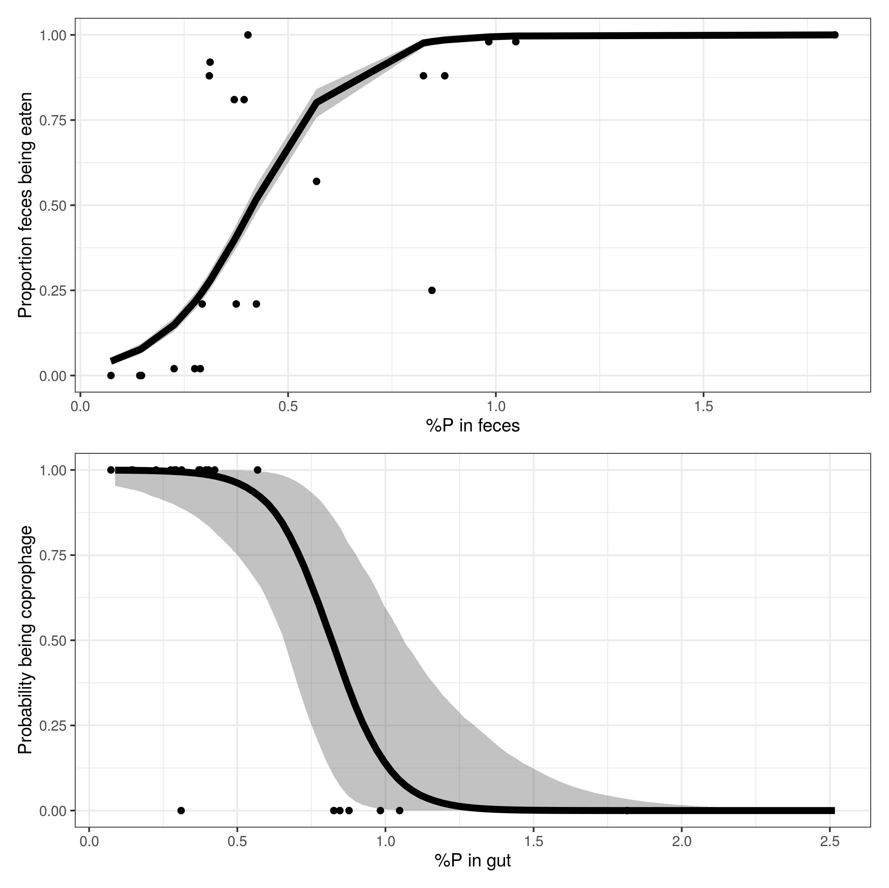

```{r setup, include=FALSE}
knitr::opts_chunk$set(echo = FALSE, warning = FALSE, message = FALSE)
```

```{r,  include=FALSE}
library(tidyverse)
library(ggrepel)
library(fishualize)
library(drake)

result_ae <- readd(result_ae) %>%
  filter(location == "Moorea")

diets <- read_csv("../data/extrapolation_trophic_guilds.csv") %>%
  select(species, diet = trophic_guild_predicted) 

result <- result_ae %>% 
  left_join(diets) 
```

# The trophic role of fish feces in coral reefs

## Main message
1) Assimilation efficiency is generally very low. Therefore, the trophic role of fish poo is huge. 
2) Community structure affects quantity and quality of fish poo. 
    
## Introduction

- Coral reefs flourish in nutrient-poor conditions, and nutrients are recycled efficiently. 
- Fishes play an important role in the flux of energy and elements through storage, excretion and egestion. 
- In recent years, the importance of fish excretion has been demonstrated. 
- Fish feces lacks investigation. We have very little data on assimilation efficiency, and therefore cannot explore the role of egestion in elemental cycling. 
- In mass balance models, AE is kept constant for all fishes even though we know that diet affects AE. Further, in trophic models such as ecopath, assimilation efficiency is not incorporated explicitely. 
- Still, there are some indications that fish feces actually play a very important role in the food web. See examples of Robertson, invertebrates feeding on planktivore poo in crevices in Medsea and California. 
- So, to understand the contribution fish feces in elemental cycling and the food web, we need data on AE. 
- Here, we quantify the assimilation efficiency for 47 coral reef fish species in Moorea, French Polynesia. Further, we explore the relationship with diet. Furthermore, we use these estimates to parametrize bioenergetic models. Finally, we estimate fluxes of organic CNP on the community level by combining modeled egestion rates with UVC data of French polynesia and historic data on coprophagy.

## Methods  

### Fish collection
All fishes were collected in Moorea, French polynesia across xx sites in the lagoon, outer reef and reef passes. 
Fishes were collected using spear fishing between 10h and 14h. Fishes were pitted immidiately upon capture and transported to the lab in a cooler with ice. In the laboratory, fishes were measured and weighted. 

### Sample processing  
The gut was carefully dissected out and samples were taken from the stomach content and the end of the intestine. 
Samples were frozen for at least 24 hours, and then dry-frozen for transport. 
In Perpignan, samples were grounded to a fine powder and then sent to Michigan for elemental analysis. 
more to add..

### Data analysis  
We constructed a Bayesian model to quantify the assimilation efficiency on the species level as follows:

$$x_{1i} \sim normal(mu_{1i}, sigma_{1i}),$$
$$x_{2i} \sim normal(mu_{2i}, sigma_{2i}),$$
$$mu_{2i} = (1 - a_i) mu_{1i},$$

where $i$ is the element, $x_{1i}$ and $x_{2i}$ are measures of the elemental content of the stomach and the end of the gut respectively, and $a_i$ is the assimilation efficiency.

## results

### Figure 1: gut content, feces content, and AE off all species

```{r, echo = FALSE, fig.width = 10, fig.height = 8}
ggplot(result) +
  geom_abline(slope = 0.3) +
  geom_abline(slope = 0.5) +
  geom_abline(slope = 0.7) +
  geom_abline(slope = 0.9) +
  geom_label(aes(x = 50, y = 0.3 * 50, label = "AE = 0.7")) +
  geom_label(aes(x = 50, y = 0.5 * 50, label = "AE = 0.5")) +
  geom_label(aes(x = 50, y = 0.7 * 50, label = "AE = 0.3")) +
  geom_label(aes(x = 50, y = 0.9 * 50, label = "AE = 0.1")) +
  geom_point(aes(x = c_mu1_m, y = c_mu2_m, color =  as.character(diet)),
             size = 2) +
  geom_text_repel(aes(x = c_mu1_m, y = c_mu2_m, label = species, color = as.character(diet)), 
                  size = 3, alpha = 0.7) +
  scale_color_fish_d(option = "Coris_gaimard") +
  theme_bw() +
  labs(x = "Gut content C%", y = "Feces C%", color = "Trophic guild")

ggplot(result) +
  geom_abline(slope = 0.3) +
  geom_abline(slope = 0.5) +
  geom_abline(slope = 0.7) +
  geom_abline(slope = 0.9) +
  geom_label(aes(x = 13, y = 0.3 * 13, label = "AE = 0.7")) +
  geom_label(aes(x = 13, y = 0.5 * 13, label = "AE = 0.5")) +
  geom_label(aes(x = 13, y = 0.7 * 13, label = "AE = 0.3")) +
  geom_label(aes(x = 13, y = 0.9 * 13, label = "AE = 0.1")) +
  geom_point(aes(x = n_mu1_m, y = n_mu2_m, color = as.character(diet)), size = 2) +
  geom_text_repel(aes(x = n_mu1_m, y = n_mu2_m, label = species, color = as.character(diet)), size = 3, alpha = 0.7) +
  scale_color_fish_d(option = "Coris_gaimard") +
  theme_bw() +
  labs(x = "Gut content N%", y = "Feces N%", color = "Trophic guild")

  

ggplot(result) +
  geom_abline(slope = 0.3) +
  geom_abline(slope = 0.5) +
  geom_abline(slope = 0.7) +
  geom_abline(slope = 0.9) +
  geom_label(aes(x = 2.5, y = 0.3 * 2.5, label = "AE = 0.7")) +
  geom_label(aes(x = 2.5, y = 0.5 * 2.5, label = "AE = 0.5")) +
  geom_label(aes(x = 2.5, y = 0.7 * 2.5, label = "AE = 0.3")) +
  geom_label(aes(x = 2.5, y = 0.9 * 2.5, label = "AE = 0.1")) +
  geom_point(aes(x = p_mu1_m, y = p_mu2_m, color = as.character(diet)),size = 2) +
  geom_text_repel(aes(x = p_mu1_m, y = p_mu2_m, label = species, color = as.character(diet)), 
                  size = 3, alpha = 0.7) +
  scale_color_fish_d(option = "Coris_gaimard") +
  theme_bw() +
  labs(x = "Gut content P%", y = "Feces P%", color = "Trophic guild", shape = "Location")


```

### Figure 2: AE correlation with diet

Note: there are multiple options here, but I think the nicest would be to have some kind of component analysis plot, made with relative abundance of otu's per Phylum using Jordan's massive dataset. Then something simpler such as phylogeny and trophic level can be used to extrapolate on the community level.  

```{r, echo = FALSE, message=FALSE, warning = FALSE}
ggplot(result) +
  geom_point(aes(x = c_mu1_m, y = c_a_m), size = 3) +
  geom_smooth(aes(x = c_mu1_m, y = c_a_m), 
              method = "lm", se = FALSE, alpha = 0.4, size = 1) +
  theme_bw() +
  labs(x = "%C gut", y = "AE (C)")
ggplot(result) +
  geom_point(aes(x = n_mu1_m, y = n_a_m), size = 3) +
  geom_smooth(aes(x = n_mu1_m, y = n_a_m), 
              method = "lm", se = FALSE, alpha = 0.4, size = 1) +
  theme_bw()+
  labs(x = "%N gut", y = "AE (N)")

ggplot(result) +
  geom_point(aes(x = p_mu1_m, y = p_a_m), size = 3) +
  geom_smooth(aes(x = p_mu1_m, y = p_a_m), 
              method = "lm", se = FALSE, alpha = 0.4, size = 1) +
  theme_bw()+
  labs(x = "%P gut", y = "AE (P)")
```

```{r, echo = FALSE, message=FALSE, warning = FALSE}
ggplot(result) +
  geom_jitter(aes(x = diet, y = c_a_m, color = as.character(diet)), width = 0.2) +
  geom_boxplot(aes(x = diet, y = c_a_m, fill = as.character(diet)), 
               alpha = 0.5, outlier.alpha = 0) +
  scale_color_fish_d(option = "Coris_gaimard") +
  scale_fill_fish_d(option = "Coris_gaimard") +
  labs(x = "Trophic guild", y = "AE (C)") +
  theme_bw() +
  theme(legend.position = "none")

ggplot(result) +
  geom_jitter(aes(x = diet, y = n_a_m, color = as.character(diet)), width = 0.2) +
  geom_boxplot(aes(x = diet, y = n_a_m, fill = as.character(diet)), 
               alpha = 0.5, outlier.alpha = 0) +
  scale_color_fish_d(option = "Coris_gaimard") +
  scale_fill_fish_d(option = "Coris_gaimard") +
  labs(x = "Trophic guild", y = "AE (N)") +
  theme_bw() +
  theme(legend.position = "none")

ggplot(result) +
  geom_jitter(aes(x = diet, y = p_a_m, color = as.character(diet)), width = 0.2) +
  geom_boxplot(aes(x = diet, y = p_a_m, fill = as.character(diet)), 
               alpha = 0.5, outlier.alpha = 0) +
  scale_color_fish_d(option = "Coris_gaimard") +
  scale_fill_fish_d(option = "Coris_gaimard") +
  labs(x = "Trophic guild", y = "AE (P)") +
  theme_bw() +
  theme(legend.position = "none") 
```
Trophic guilds:    
1) Sessile invertivores: species predominantly feeding on Asteroidea, Bryozoa, Cirripedia, Porifera,and Tunicata    
2) Herbivores, microvores,and detritivores (HMD): species primarily feeding on autotrophs, detritus, inorganic material, foraminifera,and phytoplankton    
3) Corallivores: species primarily feeding on Anthozoa and Hydrozoa    
4) Piscivores: species primarily feeding on Actinopterygii and Cephalopoda    
5) Microinvertivores: species primarily feeding on Annelida, Arachnida, Hemichordata, Nematoda, Peracarida,and Nemertea   
6) Macroinvertivores: species primarily feeding on Mollusca and Echinodermata     
7) Crustacivores: species primarily feeding on Decapoda and Stomatopoda     
8) Planktivores: species mainly feeding on zooplankton and Harpacticoida    

### Figure 3
This could be a multipanel with:
1) Relationship between feces cnp and probability of being eaten by other fish (data from Robertson)
2) % of fish feces being excreted during the night (calculated combining gut volume data and bioenergetic modeling)
          

I digitalised Robertson's data and tested some models and it seems like phosphorus is the best predictor both to dermine whether poo is being eaten and whether a fish is a coprophage. (see below) Interesting to include in paper? 


```{r}

```


### Figure 4 
A beautiful scheme showing the fluxes of organic CNP through fishes in a simplistic community (using functional groups).
I am seeing fish drawings, arrows with widths proportionate to the amount of daily poo flow. 
This incorporates both flow to the benthic detritus pool and back to the other fish functional groups (notably herbivores/detrivores) through coprophagy. 
The values can be based on an average across communities in French polynesia (all modeled seperately using fishflux first). 


## Additional ideas 

- instead of one drawing, we have two drawings showing contrasting communities: a "pristine" community and an impacted community with low complexity and a lot of fishing (lots of small herbivores, like Moorea).
- A more extensive analysis showing the effect of different community compositions on egestion rates as well as poo quality
We can use the RLS for this. I contacted Rick and Graham and got all the available community data for French Polynesia. 
- Another option may be to look at time series of community-level egestion rates

## Some notes   
- There seems to be no real effect of body size or intestine morphology on assimilation efficiency. The most important predictor I find is the gut content elemental content. 


