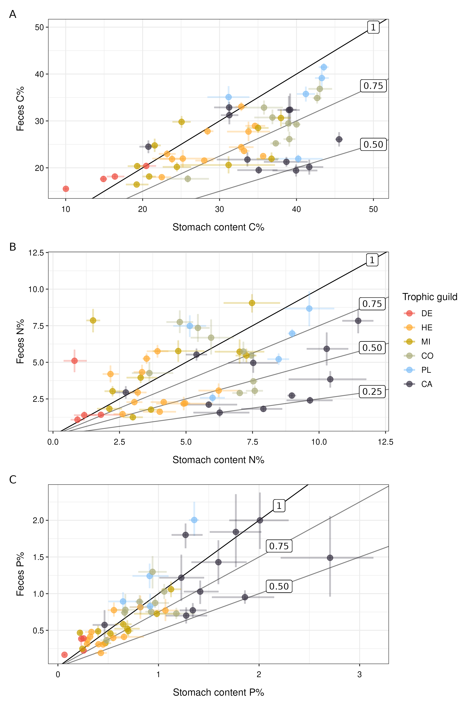
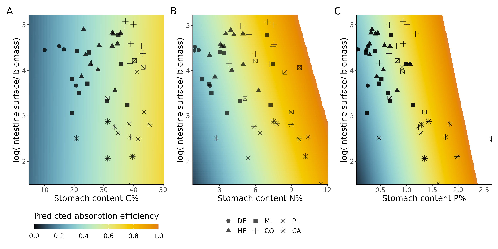

```{r setup, include=FALSE}
knitr::opts_chunk$set(echo = FALSE, warning = FALSE, message = FALSE)
```

## Main message
1) Assimilation efficiency is generally very low. Therefore, the trophic role of fish poo is huge.
2) Food quality positively affects assimilation efficiency
3) Poo quality predicts coprophagy
4) Herbivores potentially eat a lot of poo

## Introduction

Consumers play an essential role in biogeochemical cycles through the release of nutrients and energy [@Sterner2002].
Inorganic nutrient release (ie excretion) can strongly impact primary producers, particularly in systems limited by nitrogen or phosphorus [@Covich1999; @Dougthy2016; @McNaughton1999; @Turner2015].
In particular, dense aggregations of consumers can create hotspots of nutrient release and primary productivity [eg @McIntyre2008; @Shantz2015].  
In comparison, organic nutrient release (ie egestion) has received less attention. There is a general assumption that egestion is less important for nutrient cycling because of its low bioavailability and nutrient-poor organic form [@Atkinson2014; @Halvorson2019].
However, across many aquatic consumers fluxes of N and P in the form of egestion actually exceed N and P excretion fluxes [@Halvorson2019; @Liess2014].        

Egesta can have large impact in ecosystem-wide elemental cycling [@Halvorsen2019].
They can serve as a food source for other animals who in turn release inorganic nutrients [@Zimmer2002; @LeMezo2021] and they may impact the activity of decomposing heterotrophic bacteria [@Parr2019; @Halvorsen2017; @Turner2002].
The quality of egesta depicts whether it may serve as a direct food source for other animals - who may ingest feces with a nutritional quality that exceeds their diet [@Bailey1982].
In fact, coprophagy is a common phenomenon, suggesting that feces can have high nutrient contents and thus play an important trophic role by immediately re-entering the food web [@Robertson1982; @LeMezo2021; @Sazima2003; @Frankenberg1967; @Zimmer2002].

The rate and quality of egestion depend on the diet, the needs of the consumer, and element-specific absorption efficiencies (i.e. the proportion of the ingested material that is absorbed in the intestinal tract).
Consumers with low diet quality need to compensate by increasing their consumption [@Cruz-rivera2000].
As nitrogen and phosphorus growth limitation is common across aquatic herbivores and detritivores, compensatory feeding helps these consumers to reach their daily requirements [@Evans-White2017; @McIntyre2008; @Schindler1997].
However, detritivores and herbivores can exhibit different compensatory feeding strategies: herbivores may up-regulate consumption on low-nutrient resources, and detritivores up-regulate consumption on higher-nutrient resources [@Evans-White2017].
Further, compensatory feeding is strengthened by the positive correlation between diet quality and absorption efficiency - consumers with low nitrogen or phosphorus diets also have low assimilation of these elements [@Jochum2017; @Halvorson2017ecology; @Pandian1985].
On the other hand, the digestive tract can also act as a nutrient balancing organ [@Clissold2010].
Such compensatory responses where the absorption efficiency is elevated for limiting elements has been shown for an insect herbivore [@Clissold2010], yet the phenomenon appears rare to our knowledge.
Thus, the lower the quality of the diet, the lower the quality of the feces, and the higher the rate of egestion.

In coral reefs, fishes represent a large part of the consumer biomass and play an essential role in the recycling of nutrients.
While in recent years, much work has been done to quantify excretion rates, studies on fish egestion in coral reefs are rather scarce.
However, fish feces may represent an important food source for coral reef fishes [@Robertson1982; @Bailey1982], and invertebrates living in crevices where fishes rest at night [@Pinnegar2006]. Fish feces of detritivores may affect corals etc?
Further, little is known about the rate of coral reef fish egestion. While bioenergetic models can be used to estimate rates of egestion, these models are hampered by the lack of information on absorption efficiencies. To date, bioenergetic models applied in coral reef communities have used constants (ref), but as diet may vary a lot,  and the quantification via bioenergetic models is hampered by the   

coral reef paragraph
* Assimilation efficiency and fishes. Fishes play an important role in the flux of energy and elements.
In mass balance models, AE is kept constant for all fishes even though we know that diet affects AE. Further, in trophic models such as ecopath, assimilation efficiency is not incorporated explicitly. Still, there are some indications that fish feces actually play a very important role in the food web. See examples of Robertson, invertebrates feeding on planktivore poo in crevices in Medsea and California.
* Coral reefs flourish in nutrient-poor conditions, and nutrients are recycled efficiently. Important role of fish pee and poo.
In recent years, the importance of fish excretion has been recognized and estimated (Burkepile, Allgeier &co). In 80ies Robertson sheds light on the prevalence of coprophagy, hinting on the important trophic role of fish feces. Information on assimilation efficiency in coral reefs is lacking. To fully grasp the role of fishes in nutrient cycling, we need to quantify this parameter.

Goals:
- Compare poo quality across fishes. Test if: (1) absorption is higher when diet cnp\% is higher, and (2) test if there are signs of post-consumption nutrient balancing in the gut.
- Compare poo quality and diet quality across Fishes
- Assess what drives assimilation efficiency
- Compare excretion and egestion  

Here, we estimate and compare CNP% contents of diet and feces for 51 common coral reef fish species from 15 families in Moorea, French Polynesia. Further, we explore if the stoichiometry of feces varies from the diet stoichiometry, i.e. if the absorption of C, N and P differs. We also test whether there elemental limitation can explain nutrient balancing in the digestive tract. Furthermore, we establish potential coprophagic links and compare those with historical observational data [@Robertson1982]. Finally, using bioenergetic modeling, we compare the N and P flux and ratio's in excretion and egestion of our study species and on the community level.        


## Methods  

### Data collection and  processing
All fishes were collected in Moorea, French polynesia across 89 sites in the lagoon, outer reef and reef passes.   
Common species were targeted, resulting in a selection of 51 species from 15 fish families: Cirrhitidae, Zanclidae, Balistidae, Holocentridae, Chaetodontidae, Acanthuridae, Labridae, Aulostomidae, Mullidae, Serranidae, Pomacentridae, Pomacanthidae, Lethrinidae, Tetraodontidae, and Monacanthidae. In total, we collected 625 individuals. All fishes were collected using spear fishing between 10am and 1pm. Fishes were pitted immediately upon capture and transported to the laboratory in a cooler filled with ice. In the laboratory, fishes were measured, weighted, and samples were taken from the stomach content and posterior end of the gut. For fishes that do not contain a stomach (e.g. Labridae), a sample from the anterior part of the gut was taken instead. In some cases the anterior or posterior end of the gut was empty, in which case we could not collect a sample. On average, we took 8 and 10 samples of anterior and posterior parts of the gut respectively per species. We took a minimum of 3 samples per species for both the anterior and posterior part of the gut. \par

Samples were frozen for at least 24 hours, and then dry-frozen for transport.
Then, samples were grounded to a fine powder using a homogenizer. Samples were then sent to the University of Michigan Biological Station and CNP% contents were measured in the lab using standard methods. Ground samples were analyzed for \%C and \%N content using a CHN Carlo-Erba elemental analyzer (NA1500), and  for \%P using dry oxidation-acid hydrolysis extraction followed by a colorimetric analysis [@Allen1974]. Elemental content was calculated based on dry mass. \part

Ash contents of diet and feces samples were determined by combustion at 450 \degrees C in a muffle furnace for at least 6h. The ash content was calculated by dividing of the weight of the sample after combustion by the dry weight of the sample before combustion. As often times the material was too small to do nutrient and ash content analysis, we determined the ash content for xx samples. Ash contents for missing species were estimated using literature or an average per diet type (see supplemental table xx). \par

To summarize and visualize results, we divided the study species into six trophic guilds, mostly based on @Parravicini2020: \newline
1) Detritivores ( and microvores): species primarily feeding on detritus or microorganisms \newline
2) Herbivores: species primarily feeding on autotrophs \newline
3) Mixed invertivores: combined group of species (microinvertivores, macroinvertivores, and sessile invertivores) feeding on Asteroidea, Bryozoa, Cirripedia, Porifera, Annelida, Arachnida, Hemichordata, Nematoda, Peracarida, Nemertea, Mollusca and Echinodermata, and Tunicata \newline
4) Corallivores: species primarily feeding on Anthozoa and Hydrozoa \newline
5) Planktivores: species mainly feeding on zooplankton and Harpacticoida \newline
6) Carnivores: species primarily feeding on Actinopterygii, Cephalopoda, Decapoda, and Stomatopoda \newline

In their paper, @Parravicini2020 have a trophic guild combining detritivores and herbivores, but since there is a large nutritional difference between algae and detritus/microbes, we categorized *Acanthurus pyroferus*, *A. olivaceus*, *Ctenochaetus striatus*, and *Chlorurus spilurus* into a seperate group of detritivores for this study [@Eagle2004; @Choat2002]. \par

Finally, we digitalized the data provided in the paper by @Robertson1982. Per species, we noted the number of defecation events observed as well as the number of feces observed being eaten by another fish species. Further, we compiled a table indicating whether or not a species was classified as a coprophage. We combined this information with our species-level estimates of diet and feces nutrient content, resulting in a selection of 14 species.  
We then predicted the probability of feces being eaten with the nutrient content of feces. Further, we predicted the probability of being a coprophage with the nutrient content of the stomach content. \par

### Data analysis    
We predicted the average diet and feces content for C, N, and P by fitting a Bayesian robust regression model per species with rstan [ref]. We fitted the data to a student-t distribution to decrease influence of outliers:

$$
x_{i,k} \sim student(nu_{i,k}, mu_{i,k}, sigma_{i,k}),
$$
where $i$ is either diet or feces, $k$ is the element, $x_{diet,k}$ and $x_{feces,k}$ are measures of the elemental content of the stomach and the end of the gut respectively, $nu$ is the degrees of freedom, $mu$ is the average elemental content, and $sigma$ is the standard deviation of the distribution.     
We used weakly-informative priors:
$$mu_{i,c} \sim normal(30,30),    $$
$$mu_{i,n} \sim normal(5,5),    $$
$$mu_{i,p} \sim normal(1,1),    $$
$$sigma_{i,c} \sim cauchy(0,5),    $$
$$sigma_{i,n} \sim cauchy(0,1),    $$
$$sigma_{i,p} \sim cauchy(0,0.5),    $$
$$nu_{i,k} \sim gamma(2,0.1) $$

Models were run for 4 cores, with each 2000 iterations of which 1000 iterations of warm-up. This resulted in 4000 estimates for each parameter. Using these estimates we also calculated C:N, C:P, and N:P ratio's of diet and feces. Finally, we estimated the absorption efficiency. Because diet and fecal samples were taken at the same time, we could not assume that the diet items in the stomach are the same as the digested material in the feces. Therefore, we considered them as independent samples, and we used the iterations of the modeled averages of diet and feces contents. We calculated the absorption efficiency for each iteration using the following formula [@Montgomery1980]:
$$
a_k = 1 - (\frac{ash_{diet}}{ash_{feces}} \frac{mu_{feces,k}}{mu_{diet,k}})
$$
For each parameter described above, we then calculated the mean, standard deviation, 95\%, and 50\% credible intervals. \par

To assess the relationship between the probability of being a coprophage and the N and P content, we fitted Bayesian binomial models:
$$y_{cop, k} ~ Bernoulli(eta_k)$$
$$logit(eta) = b0 + b1 D_k,$$
where k is the nutrient (N or P), eta is the expected value, b0 is the intercept, b1 is the slope, and $y_{cop}$ is the probability of being a coprophage.
We fitted similar models to relate the probability of feces being eaten with the nutrient content of feces. \par

Then, we tested the hypothesis if the elemental content of the diet can predict the absorption efficiency.
We did this by fitting the following Bayesian model using the R package brms with uninformative priors [ref]:
$$a_k ~ beta(mu_k phi, (1 - mu_k) phi),$$
$$logit(mu_k) = b0_{k] + b_k D_k,$$
where k is the element (C, N, or P), b0 is the intercept, b is the slope, mu is the expected value, and phi is the dispersion parameter. mu represents a probability and must therefore be between 0 and 1, hence why the logit link function is used to map the linear predictor to mu.

### Bioenergetic models
For each species, we ran bioenergetic models for a median body size to predict the N and P flux in excretion and egestion using fishflux (ref).
We used diet elementary content and absorption efficiencies quantified in this study. For all other parameters, we used values quantified in chapter 4.
We then calculated the ratio's of egestion and excretion for N, P and the N:P ratio.

Finally, we estimated the P fluxes on the community level using underwater visual census data of the outer slope of Moorea. MORE INFO ON VISUAL census
For each individual in the community, we fitted a bioenergetic model and predicted the P flux in consumption, excretion, and egestion. Then by summing up these values, we estimated the total fluxes per trophic guild. Further, we estimated the amount of P from egestion that is consumed by coprophagous fishes by multiplying the predicted probability of feces being consumed by half of the daily egestion rates. This calculation rests on the assumption that fishes release half of their daily egestion while resting close to the reef either by day or night. Since the metabolism and digestion of fishes is higher when they are active, our estimates of coprophagy are rather conservative.
We standardized excretion and egestion of each trophic group by the total amount egested.  

## results

### Elemental stoichiometry of gut contents and feces
The estimates of species-level elemental composition of the gut contents of fishes varied remarkably among fishes, but to a varying degree for carbon (C), nitrogen (N) and phosphorus (P) (fig. 1, fig. S1).
The C content of gut contents varied 4.5-fold from 10.0\% for *Acanthurus pyroferus* to 45.5 \% for *Myripristis berndti*, and the C content of fish feces varied 2.7-fold from 15.5 \% for *Acanthurus pyroferus* to 41.5\% for *Chromis xanthura*.
The N content of gut contents varied 12.9-fold from 0.9\% for *Acanthurus pyroferus* to 11.5 \% for *Aulostomus chinensis*, and the N content of fish feces varied 8.2-fold from 1.1 \% for *Acanthurus olivaceus* to 9.0\% for *Forcipiger flavissimus*.
The P content of gut contents varied 27-fold from 0.1\% for *Ctenochaetus striatus* to 2.7 \% for *Cephalopholis urodeta*, and the P content of fish feces varied 2.7-fold from 0.2 \% for *Ctenochaetus striatus* to 2.0\% for *Chromis xanthura*.
When comparing diet content and feces compositions, we find a remarkably low difference between them for many species (fig. 1).
For C and P, the percentage in feces is hardly ever lower than half of the gut content, and for N, 14 species have a percentage in N that is lower than half compared to the gut content. We estimated a higher C, N, and P content in feces than in diet for 10, 19, and 22 species respectively.

```{r, fig.cap = "Fig. 1. The estimated carbon (A), nitrogen (B), and phosphorus (C) contents of gut contents and feces. Lines indicate the ratio of the elemental content of the feces and the gut content."}

```

Comparing the percentage of N and P of gut contents and feces among all species, we find that many species have a lower N\% or P\% value compared to the feces of other fishes (fig.2A,B; fig. S2). In particular detritivorous and herbivorous fishes have a much lower nutrient concentration in their diet compared to the feces of other trophic groups. For N, corrallivorous and planktivorous fishes have a high N content in their feces compared to the diet of lower trophic groups. For P, mostly planktivores and carnivores have P-rich feces.
Specifically, for 677 of all potential pairwise comparisons the gut content N\% is lower than feces N\%, and for 915 pairwise comparisons the gut content P\% is lower than the feces P\% (with credible intervals of 75\%).
Further, by coupling our compositional data with observational data found in the literature [@Robertson1982], we find that the probability of being a coprophage can be predicted by the N\% or P\% found in the gut content, such that the lower the nutrient content in the diet, the higher the chance of being coprophagous (fig. 3C,D). The slopes of the binomial regressions are -5.86 (-15.49 - -1.18 95\%CI) and -8.63 (-17.90 - -2.51 95\%CI) for N and P respectively.
Based on these relationships we estimate that 23 out of our 51 study species could be coprophagous (based on a probability higher than 75\%).
Furthermore, the probability of feces being fed on by coprophagous fishes can be predicted by N\% or P\% in the feces (fig. 3E,F).
The slopes of the beta regressions are 1.54 (1.29 - 1.78 95\%CI) and 2.61 (2.07 - 3.17 95\%CI) for N and P respectively.
We estimate that 31 of our study species have feces that could act as a food source for other fish species (with a higher than 75% probability).

```{r, fig.cap = "Fig. 2 Pairwise comparisons of gut content and feces per trophic guild for N (A) and P (B); fitted probabilities of being coprophagous based on N or P gut content (C,D); fitted probabilities of feces being eaten based on fecal N or P content (E,F)"}

```

### Absorption efficiencies
We then estimated element-specific absorption efficiencies for all species by combining our compositional data with ash content data to account for total absorption.
Fish families Aulostomidae, Holocentridae, and Serranidae have the highest absorption efficiencies (fig. 3A).
Per trophic guild, carnivorous fishes have the highest absorption efficiencies followed by corallivores. In particular, detritivorous acanthurids and planktivorous pomacentrids have low, negative absorption efficiencies (fig. 3B).
For detritivorous acanthurids, the negative absorption efficiencies can be explained by the fact that they contain a gizzard like stomach in which they retain inorganic material for grinding dietary food particles  [@Horn1989; @Layman2006]. This probably caused a substantial underestimation of diet quality, thus yielding negative assimilation efficiencies.
For planktivorous pomacentrids, the negative absorption efficiencies may be because there is a high proportion of indigestible plankton exoskeleton (chitin), which is not taken into account here.
We excluded negative absorption efficiencies for further analysis and attributed a constant of 0.1 for bioenergetic modeling.
We then tested the relationship between diet elementary content and absorption efficiencies (fig. 3C). We found that the N-specific absorption efficiency augments with stomach content N with more than 95% credibility (average slope: 0.35; 95% CI: 0.09-0.62). This diet effect is lower for C (average slope: 0.14 ; 95% CI:  -0.12-0.40), and not present for P (average slope: 0.03; 95% CI: -0.24-0.30).
Based on the back-transformed intercepts, we estimate that the absorption efficiency of N is generally the highest (average: 0.59; 95%CI: 0.52-0.65), followed by C (average: 0.54; 95%CI: 0.47-0.60), and P (average: 0.43; 95%CI: 0.36-0.49).

```{r, fig.cap = "Fig. 3. Absorption efficiencies per fish family (A), and trophic guilds (B); fitted absorption efficiencies with standardized elemental contents of the stomach content (C). Lines show the average fitted values, and the shaded areas indicate the 95% credible interval."}

```

### Egestion rates
Using the estimated diet elemental contents and absorption efficiencies, we applied bioenergetic models for all 51 species at median size, and estimated the daily N and P flux in excretion and egestion.
We find that the log release ratio (egestion/excretion) is almost exclusively higher than zero for P, with exception of *Chaetodon citrinellus*, *Epibulus insidiator*, and *Epinephelus merra*, indicating that there is more P flux through egestion than through excretion. For N, there is more N flux in egestion compared to excretion for 29 species. Mostly carnivorous and corallivorous species excrete more N than they egest.
Consequently, the release ratio of the N:P ratio shows that the N:P ratio of excretion tends to be higher than the N:P ratio of egestion for most species (40 species). \par

```{r, fig.cap = "Release ratio (i.e. egestion divided by excretion) for N and P (A, B), and the N:P ratio (C,D) per family (A,C), and trophic guild (B,D)."}
knitr::include_graphics("../output/plots/fig4_RR.png")
```

As a case study, we estimated the P fluxes on the community level for outer reefs in Moorea, French Polynesia (fig. 5). We find that 82.4% of the total consumed P is released in egestion compared to 8.7% in excretion. This can be explained by the high abundance of detritivores and herbivores present on the reefs of Moorea. We estimate that herbivores and detritivores alone egest 71.1% of the total consumed P, while this egestion has a low concentration of P.


```{r, fig.caption = "Fig.5. Scheme showing the average P fluxes in egestion and excretion per trophic group in Moorea, French Polynesia."}
knitr::include_graphics("../output/plots/ae_fig6.png")
```

## Discussion

General paragraph summarizing results

para about elemental contents and AE's with literature

para about coprophagy

para about absorption efficiencies and complementary feeding

para about loss of species and potential coprophagy loss corralivores and planktivores

## Supplemental material

```{r, fig.caption = "Fig. S1. Species-level estimates of the C, N, and P content of the gut contents (circles) and the feces (triangles). The thin lines indicate the 95% CI, and the thicker lines show the 50% CI. The color scale indicates the ratio between feces and diet elemental content. The color scale is only shown if there is no overlap of the 50% CI's of both."}
knitr::include_graphics("../output/plots/figs1.png")
```

```{r, fig.caption = "Fig. S2. Species-level pairwise comparisons between the proportion of N and P of gut contents and feces. Vertical lines indicate the species for which the feces have a predicted probability of being eaten that is higher than 50%. Horizontal lines indicate the species that have a higher than 50% probability of being coprophagous."}
knitr::include_graphics("../output/plots/figS2.png")
```

```{r}
library(flextable)
library(tidyverse)
table <- readr::read_csv("../output/data/ash_species_estimate.csv") %>%
  rename(diet = diet2) %>%
  mutate(species = gsub("_", " ", species))

flextable(table) %>%
  italic(j = "species") %>%
  fontsize(size = 8) %>%
  fontsize(size = 10, part = "header") %>%
  set_caption("Table S1: Overview of species-specific estimated ratio's between ash of gut content and feces from this study and literature.") %>%
  autofit()
```
