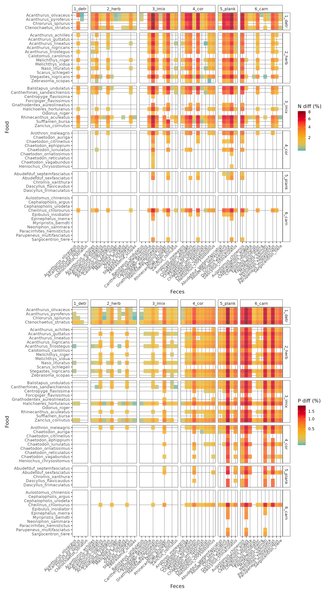

---
output:
  word_document:
    fig_caption: yes
    reference_docx: ../text/word_template.docx
bibliography: ../text/biblio.bib
csl: ../text/oikos.csl
standalone: TRUE
---

```{r setup, include=FALSE}
knitr::opts_chunk$set(echo = FALSE, warning = FALSE, message = FALSE)
```

# Fish feces drive nutrient cycling on coral reefs


Authors:

Nina M. D. Schiettekatte, Jordan M. Casey, Simon J. Brandl, Alexandre Mercière, Sam Degregori, Deron Burkepile, Jacey Van Wert, Sébastien Villéger, Valeriano Parravicini

## Abstract
Consumers play an important role in biogeochemical cycles through the consumption and release of essential elements such as carbon (C), nitrogen (N), and phosphorus (P). Indeed, a large proportion of consumed elements are rapidly released back into the environment in inorganic (i.e., excretion) or organic form (i.e., egestion).
On coral reefs, fishes represent a large part of the consumer biomass and thus play a key role in the recycling of nutrients.
In recent years, excretion rates have been studied intensively, but less is known about the rate and quality of coral reef fish egestion. Nonetheless, fish feces can be an important food source for other animals or fuel the microbial community.
In this study, we aim to fill this knowledge gap by quantifying the elemental contents of fish feces, estimating absorption efficiencies, and comparing egestion and excretion rates for 51 coral reef fish species.
We show that elemental concentrations decrease remarkably little from food to feces, due to predominantly low absorption efficiencies, resulting in large amounts of energy and nutrients being egested. Moreover, we highlight that the quality of fish feces varies across trophic guilds but remains highly variable even within trophic guilds. Finally, we demonstrate that the N and P release is higher in fish egestion compared to excretion for most species.
Overall, our study affirms the need for incorporating animal egestion alongside excretion in assessments of ecosystem functioning and food web structures.


## Introduction

Aquatic consumers play an essential role in biogeochemical cycles through consumption, assimilation, and release of major elements such as carbon (C), nitrogen (N), and phosphorus (P) [@Sterner2002].
A large proportion of consumed elements is not assimilated and released back into the environment in either inorganic or organic form [@Sterner2002; @Kraft1992].
Inorganic nutrient release (i.e., excretion) strongly impacts primary producers, particularly in systems limited by nitrogen or phosphorus [@Doughty2016; @Turner2002].
In particular, dense aggregations of consumers can create hotspots of N and P and boost primary productivity [e.g., @McIntyre2008; @Shantz2015].
On the other hand, organic release (i.e., egestion) can either serve as a food source for other consumers which in turn release inorganic nutrients [@Robertson1982; @LeMezo2021] or, if not consumed directly, provide a substrate for decomposing heterotrophic bacterial communities [@Parr2019; @Halvorson2017; @Turner2002]. \par

Egestion represents a dominant and dynamic animal-mediated elemental flux [@Halvorson2019].
While there is a general assumption that egestion is less important for elemental cycling because of its low bioavailability and nutrient-poor organic form [@Atkinson2014; @Halvorson2019], N and P in the form of egestion actually exceed N and P excretion fluxes in many aquatic consumers [@Halvorson2019; @Liess2014].
The quality of egesta determines whether it may serve as a direct food source for other animals, which may ingest feces with a nutritional quality that exceeds their diet [@Bailey1982].
In fact, coprophagy (i.e., the consumption of feces) is a common phenomenon across a variety of ecosystems, and may play an important trophic role by immediately re-integrating valuable elements into the food web [@Robertson1982; @LeMezo2021; @Sazima2003; @Frankenberg1967]. \par

The rate and quality of egestion depend on the food, the nutritional needs of the consumer, and element-specific absorption efficiencies (i.e., the proportion of the ingested material that is absorbed in the intestinal tract) of the consumer.
Naturally, the quality of egestion (i.e., concentrations of C, N, and P) directly correlates with the quality of the diet [@Sterner2000], while also indirectly affecting the rate of consumption and thus egestion [@Schiettekatte2020].
Consumers with low diet quality such as herbivores (i.e., animals feeding on primary producers) or detritivores (i.e., animals feeding on detritus), for instance, compensate for the poor nutritional quality by increasing their consumption rates to reach their daily nutritional needs [@Cruz-Rivera2000].
Since N and P are often the limiting element for the growth of aquatic herbivores and detritivores, compensatory feeding helps these consumers to reach their daily requirements [@Evans-White2017; @McIntyre2008; @Schindler1997].
Furthermore, compensatory feeding is promoted by the positive correlation between diet quality and absorption efficiency - consumers with low N or P diets also tend to have low absorption efficiencies of these elements [@Jochum2017; @Halvorson2017ecology; @Pandian1985].
On the other hand, the digestive tract may act as a nutrient balancing organ by increasing the absorption efficiency of a limiting element, yet this phenomenon appears to be rare [@Clissold2010].\par

On coral reefs, fishes represent a large part of the consumer biomass and play an essential role in the recycling of nutrients.
While in recent years, excretion rates have been studied intensively (@Allgeier2014; @Allgeier2016; @Francis2018), less is known about the rate and quality of coral reef fish egestion.
Fish feces likely represent an important food source for coral reef fishes [@Robertson1982; @Bailey1982] and invertebrates living in crevices where fishes rest at night [@Pinnegar2006], little quantitative data exists on the rates of defecation, the uptake of feces, and the nutritional properties of feces.
While bioenergetic models can be used to estimate rates of egestion, a lack of information on absorption efficiencies may introduce bias. To date, bioenergetic models applied in coral reef communities use constants for element-specific absorption efficiencies [e.g., @Allgeier2014; @Schiettekatte2020], which hampers the use of bioenergetic models to quantify egestion rates. \par

Here, we aim to quantify the rate and nutritional quality of egestion for a wide range of reef fishes.
Specifically, we estimate and compare the C, N, and P concentrations of the food and feces for 51 common coral reef fish species from 15 families in Mo'orea, French Polynesia. With these data we then estimate the element-specific absorption efficiencies and link them to each species' diet.
Combining our data with historical observational data on defecation rates and consumption [@Robertson1982], we further establish potential coprophagic links through pairwise comparisons.
Finally, we use our data to parametrize bioenergetic models, and compare the N and P flux in excretion and egestion at both species and community level. \par


## Methods

### Data collection and  processing
We collected fishes in Mo'orea, French Polynesia across 62 sites distributed across lagoon and outer reef (fig. S1).
We targeted 51 common species from 15 fish families: Cirrhitidae, Zanclidae, Balistidae, Holocentridae, Chaetodontidae, Acanthuridae, Labridae, Aulostomidae, Mullidae, Serranidae, Pomacentridae, Pomacanthidae, Lethrinidae, Tetraodontidae, and Monacanthidae (see supplemental table 1). In total, we collected 620 individuals using spear fishing between 10am and 2pm between 2017 and 2019. Fishes were pithed immediately upon capture and transported to the laboratory in a cooler filled with ice. In the laboratory, fishes were measured, weighed, and dissected to expose the full alimentary tract. Samples of ingested material were then taken from the stomach and hindgut. For fishes that do not have a stomach (e.g., Labridae), a sample from the esophagus or foregut was taken instead. When the foregut or hindgut were empty, no sample was collected. The number of replicates per species is shown in supplementary table 1. \par

Samples were frozen for at least 24 hours, and then freeze-dried for transport for at least 24h.
After lyophilization, samples were ground to a fine powder using a homogenizer. Homogenized samples were then sent to the University of Michigan Biological Station and CNP\% concentrations were measured in the lab using standard methods (in g*g-1). Ground samples were analyzed for \%C and \%N content using a CHN Carlo-Erba elemental analyzer (NA1500), and  for \%P using dry oxidation-acid hydrolysis extraction followed by a calorimetric analysis [@Allen1974]. Elemental content was calculated on a dry weight basis. \par

Ash contents of food and feces samples were determined by combustion at 450 $^{\circ}$C in a muffle furnace for at least 6h. The ash content was calculated by dividing the weight of the sample after combustion by the dry weight of the sample before combustion. Since the material was too limited for both nutrient and ash content analysis, we determined the ash content for a subset of samples to calibrate our data. Ash contents for missing species were estimated using information from the literature or based on an average estimate for each trophic guild (see supplemental table 2). \par

We divided the study species into six trophic guilds, mostly based on @Parravicini2020 (supplementary table 2):
detritivores (and heterotrophic microvores): species primarily feeding on detritus or microorganisms);
herbivores: species primarily feeding on autotrophs;
mixed invertivores: combined group of species (microinvertivores, macroinvertivores, and sessile invertivores) feeding on Asteroidea, Bryozoa, Cirripedia, Porifera, Annelida, Arachnida, Hemichordata, Nematoda, Peracarida, Nemertea, Mollusca and Echinodermata, and Tunicata;
corallivores: species primarily feeding on Anthozoa and Hydrozoa;
planktivores: species mainly feeding on zooplankton and Harpacticoida; and
carnivores: species primarily feeding on Actinopterygii, Cephalopoda, Decapoda, and Stomatopoda.

While detritivores and herbivores are combined in @Parravicini2020, we categorized *Acanthurus pyroferus*, *A. olivaceus*, *Ctenochaetus striatus*, and *Chlorurus spilurus* into a separate group of detritivores, according to direct inspection of the gut in this study, in accordance to previous literature, and due to the considerable nutritional difference between algae and detritus/microbes [@Eagle2004; @Choat2002]. \par

Finally, in order to delineate potential coprophagous behavior, we extracted the data provided by @Robertson1982, which describes the uptake of feces by fishes in a coral reef fish assemblage. For each species, we extracted the number of defecation events as well as the number of feces observed being eaten by another fish species. Further, we compiled a table indicating whether or not a species was classified as a coprophage. We combined this information with our species-level estimates of food and feces nutrient content, resulting in a selection of 14 species.
We then predicted the probability of feces being eaten with the nutrient content of feces. Furthermore, we predicted the probability of being a coprophage based on the nutrient composition of the diet. \par

### Data analysis
We predicted the average food and feces content for C, N, and P by fitting a Bayesian regression model for each species with rstan [@Carpenter2017]. We fitted the data to a student-t distribution to decrease influence of outliers:

$$
x_{i,k} \sim student(nu_{i,k}, mu_{i,k}, sigma_{i,k}),
$$
where $i$ is either food or feces, $k$ is the element, $x_{food,k}$ and $x_{feces,k}$ are measures of the elemental content of the stomach and the end of the gut respectively, $nu$ is the degrees of freedom, $mu$ is the average elemental content, and $sigma$ is the standard deviation of the distribution.
We used weakly-informative priors:
$$mu_{i,c} \sim normal(30,30),    $$
$$mu_{i,n} \sim normal(5,5),    $$
$$mu_{i,p} \sim normal(1,1),    $$
$$sigma_{i,c} \sim cauchy(0,5),    $$
$$sigma_{i,n} \sim cauchy(0,1),    $$
$$sigma_{i,p} \sim cauchy(0,0.5),    $$
$$nu_{i,k} \sim gamma(2,0.1) $$

Models were run on 4 chains, for 2000 iterations with 1000 iterations of warm-up for each chain. This resulted in 4000 estimates for each parameter. Using these estimates, we also calculated C:N, C:P, and N:P ratios of food and feces. Finally, we estimated the absorption efficiency. Because food and feces samples were taken at the same time, we could not assume that the food items in the stomach are the same as the digested material in the feces. Therefore, we considered them as independent samples, and we used the iterations of the modeled averages of food and feces contents. We calculated the absorption efficiency for each iteration using the following formula [@Montgomery1980]:
$$
a_k = 1 - (\frac{ash_{food}}{ash_{feces}} \frac{mu_{feces,k}}{mu_{food,k}})
$$
For each parameter described above, we then calculated the mean, standard deviation, 95\%, and 50\% credible intervals. \par

To assess the relationship between the probability of being a coprophage and the N and P content, we fitted Bayesian binomial models:
$$y_{cop, k} \sim Bernoulli(eta_k)$$
$$logit(eta) = b0 + b1 D_k,$$
where k is the nutrient (N or P), eta is the expected value, b0 is the intercept, b1 is the slope, and $y_{cop}$ is the probability of being a coprophage.
We fitted similar models to relate the probability of feces being eaten with the nutrient content of feces. \par

Then, we tested the hypothesis if the elemental content of the food can predict the absorption efficiency.
We did this by fitting the following Bayesian model using the R package brms with uninformative priors [@Burkner2017]:
$$a_k \sim beta(mu_k phi, (1 - mu_k) phi),$$
$$logit(mu_{k}) = b0_{k} + b_{k} D_{k}$$
where k is the element (C, N, or P), b0 is the intercept, b is the slope, mu is the expected value, and phi is the dispersion parameter. mu represents a probability and must therefore be between 0 and 1. We, therefore, used a logit link function to map the linear predictor onto mu. \par

### Bioenergetic models
Finally, we ran bioenergetic models for each species at their median measured body size to predict the N and P fluxes in excretion and egestion using fishflux (@Schiettekatte2020). These models were parametrized with the elementary concentrations of food and absorption efficiencies estimated in the present study. For all other parameters, we used values from the literature (@Schiettekatte2022).
We then calculated the ratios between egestion and excretion for N and P, and for the N:P ratio.\par

Finally, we estimated the P fluxes on the community level for the outer slope of Mo'orea.
We used visual census data from 2009 to 2016 for 13 sites, recorded as a part of the CRIOBE long-term monitoring program. During each census, a single diver swam along a transect of 25 m and counted all fishes within a width of 2 m. All fishes were identified to the species level and their length was estimated to the nearest 1 cm. Each transect covered an area of 50 m^2^, except 2 sites (Tiahura and Haapiti), which covered an area of 100 m2 each.
For each individual in the community, we fitted the described bioenergetic model and predicted the P flux in consumption, excretion, and egestion. Then by summing up these values, we estimated the total fluxes per trophic guild per square meter. Furthermore, we estimated the amount of P from egestion that is consumed by coprophagous fishes by multiplying the predicted probability of feces being consumed by half of the daily egestion rates. This calculation rests on the assumption that fishes release half of their daily egestion while resting close to the reef either by day or night. Since the metabolism and digestion of fishes is higher when they are active, such estimates of coprophagy are conservative. Finally, we averaged values across all sites and years and standardized the excretion and egestion rate of each trophic group by the total amount of P consumed by all fishes. \par

\newpage
## Results

### Elemental stoichiometry of gut contents and feces
The estimates of species-level elemental composition of the gut contents of fishes varied remarkably among fishes, together with a varying degree for carbon (C), nitrogen (N) and phosphorus (P) (fig. 1, fig. S2, table S3).
The C content of gut contents varied 4.5-fold from 10.0\% for *Acanthurus pyroferus* to 45.5 \% for *Myripristis berndti*, and the C content of fish feces varied 2.7-fold from 15.5 \% for *Acanthurus pyroferus* to 41.5\% for *Chromis xanthura*.
The N content of gut contents varied 12.9-fold from 0.9\% for *Acanthurus pyroferus* to 11.5 \% for *Aulostomus chinensis*, and the N content of fish feces varied 8.2-fold from 1.1 \% for *Acanthurus olivaceus* to 9.0\% for *Forcipiger flavissimus*.
The P content of gut contents varied 27-fold from 0.1\% for *Ctenochaetus striatus* to 2.7 \% for *Cephalopholis urodeta*, and the P content of fish feces varied 10-fold from 0.2 \% for *Ctenochaetus striatus* to 2.0\% for *Chromis xanthura*.**
When comparing diet content and feces compositions, we find a remarkably low difference between them for many species (fig. 1).
For C and P, the percentage in feces is hardly ever lower than half of the gut content, and for N, 14 species have a percentage in N that is lower than half compared to the gut content. We found a higher C, N, and P content in feces than in diet for 10, 19, and 22 species respectively.

```{r, fig.cap = "Fig. 1. The estimated average carbon (A), nitrogen (B), and phosphorus (C) contents of gut contents and feces. Lines indicate the ratio of the elemental content of the feces and the gut content."}
knitr::include_graphics("../output/plots/fig1.png")
```


\newpage
Comparing the percentage of N and P of gut contents and feces among all species, we find that many species have a lower N\% or P\% value compared to the feces of other fishes (fig.2A,B; fig. S3). In particular detritivorous and herbivorous fishes have a much lower nutrient concentration in their diet compared to the feces of other trophic groups. For N, corallivorous and planktivorous fishes have a high N content in their feces compared to the diet of lower trophic groups. For P, mostly planktivores and carnivores have P-rich feces.
Specifically, for 677 of all potential pairwise comparisons the gut content N\% is lower than feces N\%, and for 915 pairwise comparisons the gut content P\% is lower than the feces P\% (with credible intervals of 75\%).
Further, by coupling our compositional data with observational data found in the literature [@Robertson1982], we find that the probability of being a coprophage can be predicted by the N\% or P\% found in the gut content, such that the lower the nutrient content in the diet, the higher the chance of being coprophagous (fig. 3C,D). The slopes of the binomial regressions are -5.86 (-15.49 - -1.18 95\%CI) and -8.63 (-17.90 - -2.51 95\%CI) for N and P respectively.
Based on these relationships we estimate that 23 out of our 51 study species could be coprophagous (based on a probability higher than 75\%).
Furthermore, the probability of feces being eaten by coprophagous fishes can be predicted by N\% or P\% in the feces (fig. 3E,F).
The slopes of the beta regressions are 1.54 (1.29 - 1.78 95\%CI) and 2.61 (2.07 - 3.17 95\%CI) for N and P respectively.
We estimate that 31 of our study species have feces that could act as a food source for other fish species (with a higher than 75% probability).

```{r, fig.cap = "Fig. 2 Pairwise comparisons of gut content and feces per trophic guild for N (A) and P (B); fitted probabilities of being coprophagous based on N or P gut content (C,D); fitted probabilities of feces being eaten based on fecal N or P content (E,F)"}
knitr::include_graphics("../output/plots/fig2_diet_poo_pairwise.png")
```

\newpage
### Absorption efficiencies
We then estimated element-specific absorption efficiencies for all species by combining our compositional data with ash content data to account for total absorption (table S4).
Per trophic guild, carnivorous fishes have the highest absorption efficiencies followed by corallivores. In particular, detritivorous acanthurids and planktivorous pomacentrids have low, or even negative absorption efficiencies (fig. 3A).
We excluded negative absorption efficiencies for further analysis and attributed a constant of 0.1 for bioenergetic modeling.
We then tested the relationship between diet elementary content and absorption efficiencies (fig. 3B). We found that the N-specific absorption efficiency increases with stomach content N with more than 95% credibility (average slope: 0.35; 95% CI: 0.09-0.62). This diet effect is lower for C (average slope: 0.14 ; 95% CI:  -0.12-0.40), and not present for P (average slope: 0.03; 95% CI: -0.24-0.30).
Based on the back-transformed intercepts, we estimate that the absorption efficiency of N is generally the highest (average: 0.59; 95%CI: 0.52-0.65), followed by C (average: 0.54; 95%CI: 0.47-0.60), and P (average: 0.43; 95%CI: 0.36-0.49).

```{r, fig.cap = "Fig. 3. Absorption efficiencies across trophic guilds (A) and fitted absorption efficiencies with standardized elemental contents of the stomach content (B). Lines show the average fitted values, and the shaded areas indicate the 95\\% credible interval. DE = detritivores, HE = herbivores, MI = mixed invertivores, CO = corallivores, PL = planktivores, CA = carnivores."}
knitr::include_graphics("../output/plots/fig3.png")
```

\newpage
### Egestion rates
Using the estimated food elemental contents and absorption efficiencies (set to 0.1 for species with negative predicted values), we applied bioenergetic models for all 51 species at their median size, and estimated the daily N and P flux in excretion and egestion.
We then calculated the log release ratios (egestion/excretion) for N, P, and the N:P ratio. A positive release ratio thus indicates that N, P, or the N:P ratio is higher in egestion compared to excretion.
The log release ratio was almost exclusively higher than zero for P, with the exception of *Chaetodon citrinellus*, *Epibulus insidiator*, and *Epinephelus merra*, indicating that there is more P flux through egestion than through excretion. For N, there was more N flux in egestion compared to excretion for 29 species, with mostly carnivorous and corallivorous species excreting more N than they egest (fig. 4).
Consequently, the N:P ratio of excretion tends to be higher than the N:P ratio of egestion for most species (40 species). \par

```{r, fig.cap = "fig. 4. Box plots of release ratios (i.e., natural log-transformation of egestion divided by excretion) for N and P (A), and the N:P ratio (B) per trophic guild. DE = detritivores, HE = herbivores, MI = mixed invertivores, CO = corallivores, PL = planktivores, CA = carnivores."}

```
\newpage

Finally, for our case study on P fluxes at the community level for outer reefs in Mo'orea, French Polynesia (fig. 5), we found that 82.4\% of the total consumed P is released in egestion compared to 8.7\% that is released in excretion. This can be explained by the high abundance of detritivores and herbivores present on the reefs of Mo'orea, which egest 71.1\% of the total consumed P, although their feces have a low concentration of P.

```{r, fig.cap = "Fig.5. P fluxes in egestion and excretion across trophic groups in Mo'orea, French Polynesia. Egestion flows either to the benthos or to coprophages. The amount of feces being eaten by coprophages was determined by multiplying egestion rates of individual fishes in the community by the predicted probability of feces being eaten (see methods). All P fluxes are standardized by dividing by the total amount of P consumed by the fish community on a daily basis."}
knitr::include_graphics("../output/plots/ae_fig6.png")
```

\newpage
## Discussion

Understanding how consumers contribute to fluxes of energy and nutrients in ecosystems is an important challenge in ecology. The absorption efficiency of major elements defines how much food is released into a particulate form (i.e., feces). We show that, across a wide range of coral reef fishes, elemental concentrations decrease remarkably little from food to feces, due to predominantly low absorption efficiencies, resulting in considerable amounts of energy and nutrients being egested. While it is commonly assumed that excretion is the primary vector of animal-mediated nutrient flux, our results suggest that most coral reef fishes egest more N and P than they excrete, shedding light on the important role of egestion for nutrient cycling on coral reefs.
Further, the quality and quantity of fish egesta varies greatly depending on the trophic guild. As a consequence, the community structure of reef fishes highly influences organic nutrient flow at a given location.
Overall, our study affirms the need for incorporating animal egestion alongside excretion in assessments of ecosystem functioning and food web structures [@Halvorson2019; @Atkinson2017; @Halvorson2017]. \par

We provide estimates of carbon, nitrogen, and phosphorus concentrations of fish feces for 51 coral reef fish species.
Only two previous studies have analyzed the composition of coral reef fish across a small number of species. For example, in Palau, @Bailey1982 found an average N concentration of 1.52\% for *Zebrasoma scopas*, which is slightly lower than but within the credible range of our average (2.21 \%).
*Z. scopas* feed primarily on red algae, which can vary 4-fold in N concentration, which may explain this variation [@Montgomery1980]. Similarly, @Crossman2005 reported relatively low N concentrations in the feces of *A. lineatus* (1.44\%) and *A. olivaceus* (0.34\%) on reefs in the Northern Great Barrier Reef, compared to our present study (2.97\% and 2.98\%, respectively). The values reported in both studies are based on proteins or amino acids only [@Bailey1982; @Crossman2005], and we converted these protein concentrations to total N using the standard conversion factor of 1:6.25 (N:protein). However, algae can have high and variable concentrations of non-protein nitrogen substances, so the conversion we made from protein estimates by @Bailey1982 and @Montgomery1980 are likely to underestimate the total N concentration [@Lourenco2002]. We thus provide the first estimates for total C, N, and P concentrations of food and feces across 51 study species, and it appears that our values align roughly with the limited data available from previous studies. \par

We found remarkably low and variable reductions in elemental concentration between food and feces and low absorption efficiencies across species.
As expected, N absorption efficiencies are higher than C and P, since N-rich protein is more digestible than other C-rich compounds such as carbohydrates and lipids [@Pandian1985; @Crossman2005; @Montgomery1980].
Further, N absorption efficiency increases with the N concentration of the food.
This positive relationship exists in other animals [e.g., @Jochum2017], and has been suggested for total absorption efficiencies in fishes [@Pandian1985].
This means that fishes with a high-N diet assimilate N more efficiently than those with an N-poor diet, and consequently, the maintenance of fish homeostasis must be occurring through release of already assimilated nutrients (i.e., excretion).
A similar, but weaker, pattern is visible for C absorption efficiencies, while P absorption efficiencies were weakly predicted by P content in diet, and were generally low and highly variable across species [@Czamanski2011]. \par

Across trophic guilds, carnivorous fishes have the highest absorption efficiencies, which is likely because animal material is easier to digest than plant material [@Kozlovsky1968; @Pandian1985]. For corallivores, which had the second highest absorption efficiency, the high efficiency could be driven by their N-rich diet and their long intestines [@Berumen2011]. In addition, the highly specialized feeding niche of many coral-feeding chaetodontids [@Berumen2008] may have helped to boost nutrient absorption efficiencies, since the digestive organs and gut microbiomes of specialized feeders are well adapted to a specific range of prey items. In contrast to corallivores, planktivorous fishes exhibited fairly low absorption efficiencies despite having N-rich diets. Their feeding behaviour, which capitalizes on abundant zooplankton at incoming tides and their high intake rate may satisfy their daily needs even with low absorption efficiencies [@Hamner1988]. As expected, detritivorous and herbivorous fishes had generally low absorption efficiencies, but within herbivores, absorption efficiencies were remarkably variable. This is in line with previous reported absorption efficiencies for herbivorous coral reef fishes that range between 17.4% and 97.2\% for protein and between 5.3\% and 80.2\% for lipids and carbohydrates [@Crossman2005]. Herbivorous fishes have specialized digestive strategies linked with differences in diet, even though they are often designated as a single trophic category [@Crossman2005]. For example, Acanthuridae, which are predominantly classified as herbivorous fishes, exhibit fine-scale dietary, morphological, and behavioral specialization [@Brandl2015]. Our results suggest that these differences are reflected in their digestive dynamics as well. For instance, *Z. scopas* and *A. pyroferus*, which are both considered to be croppers of small algae but exhibit different morphologies and behaviors, were fundamentally different in terms of their absorption efficiencies. *Z. scopas* appears to feed almost exclusively on fine filamentous red algae, so, an interesting hypothesis to test would be whether herbivores with specialized diets have a higher absorption efficiency. Additionally, especially for herbivores, the fish gut microbiome may play a large role in digestion and resulting absorption efficiencies [@Miyake2015]. Overall, our results emphasize the high variability of absorption efficiencies among but also within trophic groups. This variation is important to consider when inferring species’ roles in system-wide energy and nutrient fluxes [@Brandl2019front]. \par

Notably, we found several negative absorption efficiencies, mostly for N and P. For some detritivorous acanthurids (e.g., *Ctenochaetus striatus*), the negative absorption efficiencies can be explained by their gizzard-like stomach in which they retain inorganic material to grind down dietary food particles [@Horn1989; @Crossman2005]. The presence of inorganic material probably caused an underestimation of food quality, and thus yielding negative assimilation efficiencies. For these species, it may be better to sample putative food sources from the environment or ingested food from the mouth or esophagus, rather than the stomach. For other taxa, explanations are less straightforward. The higher P in the feces of some planktivores compared to their stomach contents could be caused by a high density of bacteria with low C:N:P stoichiometry, a high proportion of indigestible invertebrate exoskeleton (chitin) in their planktonic prey, or selective absorption of C- and N-containing compounds [@Geesey1984]. Another possibility would be that planktivores occasionally supplement their diet with P-rich food items such as fish feces, but this peculiarity remains unresolved [@Pinnegar2006]. Finally, although we sampled to the best of our abilities, some negative absorption efficiencies may result from low sample sizes. N and P in the food are much more variable than carbon, and the more variability in food elemental stoichiometry, the higher the potential bias when sample sizes are low. Most species for which we found negative absorption efficiencies had a sample size lower than 10. On the other hand, the three species for which we have the highest sample size (n>20) also yielded the most robust species-level estimates. Overall, species consistently feeding on a single taxonomic group (e.g., piscivorous groupers) have a less variable food stoichiometry and may thus need less replicates (e.g., *Cephalopholis argus*), while especially species that ingest a conglomerate of taxa (e.g., some herbivorous fishes, planktivores, and omnivores) may require a substantial number of replicates to obtain reliable estimate of assimilation efficiencies.  \par

The low absorption efficiencies of fishes with nutrient-poor diets necessitate compensatory feeding to obtain sufficient N and P for growth and homeostasis. For example, herbivores feed on nutrient-poor algae, thus displaying a large mismatch between the food elemental concentrations and the ideal elemental composition needed for maintenance and growth [@Schiettekatte2020].
While it may seem intuitive that these fishes increase the absorption efficiency of limiting elements to ameliorate the existing nutrient imbalance [@Sterner2000], the opposite appears to be the case, as low absorption efficiencies are common in these species. Except for a single study on herbivorous terrestrial invertebrates, which compensated for a limiting element by altering absorption efficiency [@Clissold2010], compensatory feeding on nutrient-rich resources appears to be the most common approach to make up for low-nutrient diets across many taxa. Indeed, this feeding strategy has been demonstrated for freshwater invertebrates [@Evans-White2017],
insects [@Jochum2017], snail grazers [@Liess2014], and
marine amphipods [@Cruz-Rivera2000]. \par


Our results highlight the role of fish egestion for system-wide nutrient cycling. A logical consequence of the low absorption efficiencies we discovered is that nutrients may be released more abundantly through egestion instead of excretion, especially for P, resulting in feces with low N:P ratios. Similar findings have been reported for marine invertebrates [@Halvorson2019] and terrestrial vertebrates, in which urine contains little P but a high concentration of N, while feces contain most of the P [@Sitters2017].
Consumption of such P-rich feces is common among coral reef fishes, and some prey like plankton may pass through three fish stomachs before reaching the bottom [@Robertson1982]. Similarly, feces that are not consumed in the water column and reach the bottom are likely consumed by invertebrates in reef crevices [@Pinnegar2006], thus fueling a different compartment of the coral reef food web. In contrast, nutrient poor feces from herbivores or detritivores are rarely consumed directly, but are decomposed by microbial communities. Depending on the N:P ratio, these feces may exhibit an uptake of dissolved N or P, suggesting that decomposing feces may serve as a nutrient sink [@Halvorson2017]. Further, fish feces may be important vectors of bacteria to coral surfaces and even transform coral microbiomes [@Ezzat2019].
Our study calls for further research on the diverse fates of fish feces in coral reef ecosystems, to better understand the various pathways in which fish feces affect nutrient cycling and ecosystem functioning. \par

Our results have several implications for models aiming to estimate fluxes through the food web and nutrient cycling.
First, a central goal in ecology is to characterize trophic interactions and some studies have attempted to recreate complex food webs for coral reef fishes [e.g., @Bascompte2005; @Casey2019]. To understand the interaction strength of food web links, we need to estimate the amount of elements and energy flowing through these interaction which necessitates a quantification of consumption rates. To date, food web models do not take variation of absorption efficiencies into account, which may introduce substantial bias.
Further, coprophagic links have not been included in food web models, even though they may represent an important food source. For example, *Naso vlamingii* consumes up to 200 planktivore feces (12\% of its own body weight) per hour during periods of high feeding activity [@Robertson1982], suggesting that coprophageous links are a substantial part of energy and nutrient transfer.
Finally, bioenergetic models represent a useful tool to estimate multiple individual-level pathways of elements and absorption efficiencies represent important parameters [@Schiettekatte2020]. Due to a general lack of data it is common practice to use constants from the literature (e.g., 0.8 for N and C absorption efficiency, and 0.7 for P absorption efficiency), rather than values measured in the field for the particular population being modeled [@Kraft1992; @Schindler1997; @Allgeier2015; @Schiettekatte2020]. Our results illustrate that these values are not an adequate approximation for coral reef fishes, which exhibit remarkable variability in their absorption efficiency, potentially introducing significant bias in the outcomes. Collecting and curating physiological data as presented in the present study across species and locations will greatly enhance the parameterization of ecosystem models and thus increase our understanding of complex systems. \par

Finally, data on feces quality and quantity can be used to investigate additional pathways in which human impact may disrupt coral reef ecosystem functioning. Fishing selectively targets fishes with high trophic levels and large sizes [@Graham2017]. The local depletion of large predators or planktivores not only affects prey populations and decreases excretion [@Allgeier2016], but also potentially removes an important food source for coprophagous fishes.
Likewise, communities that have shifted towards dominance by detritivores and herbivores, which is observed on reefs around as Mo'orea, have a high incidence of nutrient-poor egestion.
Further, coral loss and reduced structural complexity cause declines of planktivores, large carnivores, and corallivores [@Brandl2016; @Graham2013; @Darling2017], and thus can lead to a decreased nutritional quality of feces in fish communities.
As such, system wide elemental fluxes stand to be significantly different on reefs with shifting fish assemblages, with thus far unknown consequences for ecosystem services that reefs can provide to humanity. Overall, our results highlight the important role of fish feces as a nutrient vector. More research quantifying the quality and fate of these feces is necessary to understand how changes in community structure affect ecosystem functioning through trophic interactions, nutrient translocation, and microbial activity. \par

\newpage
## Supplemental material

```{r c6sf1, fig.cap = "Fig. S1. Map of sampling stations in Mo'orea."}

```
\newpage

```{r, fig.cap = "Fig. S2. Species-level estimates of the C, N, and P content of the gut contents (circles) and the feces (triangles). The thin lines indicate the 95% CI, and the thicker lines show the 50% CI. The color scale indicates the ratio between feces and diet elemental content. The color scale is only shown if there is no overlap of the 50% CI's of both."}

```

```{r, fig.cap = "Fig. S3. Species-level pairwise comparisons between the proportion of N and P of gut contents and feces. Vertical lines indicate the species for which the feces have a predicted probability of being eaten that is higher than 50%. Horizontal lines indicate the species that have a higher than 50% probability of being coprophagous."}

```


```{r}
library(flextable)
library(tidyverse)
table <- readr::read_csv("../output/data/Table_S1.csv")

flextable(table) %>%
  italic(j = "Species") %>%
  fontsize(size = 7) %>%
  fontsize(size = 8, part = "header") %>%
  set_caption("Table S1: Overview of study species' length and weight range, trophic category, family, and number of replicates") %>%
  autofit()
```

```{r}
library(flextable)
library(tidyverse)
table <- readr::read_csv("../output/data/ash_species_estimate.csv") %>%
  rename(diet = diet2) %>%
  mutate(species = gsub("_", " ", species))

flextable(table) %>%
  italic(j = "species") %>%
  fontsize(size = 8) %>%
  fontsize(size = 10, part = "header") %>%
  set_caption("Table S2: Overview of species-specific estimated ratio's between ash of gut content and feces from this study and literature.") %>%
  autofit()
```

```{r}
library(flextable)
library(tidyverse)
table <- readr::read_csv("../output/data/Table_results1.csv") %>%
  select(-Family, -Diet)

flextable(table) %>%
  italic(j = "Species") %>%
  fontsize(size = 7) %>%
  fontsize(size = 8, part = "header") %>%
  set_caption("Table S3: Overview average elemental composition of diet and feces per species. C = carbon, N = nitrogen, P = phosphorus. Values between brackets represent the 95% credible interval.") %>%
  autofit()
```

```{r}
library(flextable)
library(tidyverse)
table <- readr::read_csv("../output/data/Table_results2.csv")

flextable(table) %>%
  italic(j = "Species") %>%
  fontsize(size = 7) %>%
  fontsize(size = 8, part = "header") %>%
  set_caption("Table S4: Overview average absorption efficiency per species. AE = absorption efficiency, C = carbon, N = nitrogen, P = phosphorus. Values between brackets represent the 95% credible interval.") %>%
  autofit()
```
