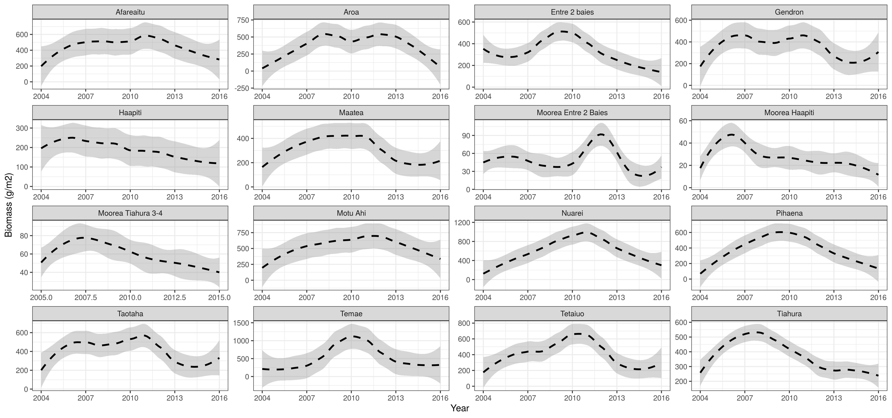
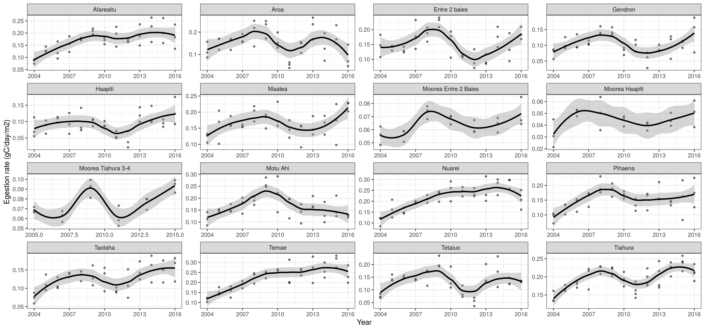
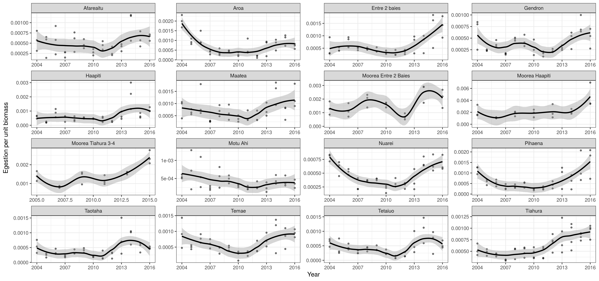

```{r setup, include=FALSE}
knitr::opts_chunk$set(echo = FALSE, warning = FALSE)
```

```{r,  include=FALSE}
library(tidyverse)
library(ggrepel)
library(fishualize)
library(drake)

result_ae <- readd(result_ae)

diets <- read_csv("../data/extrapolation_trophic_guilds.csv") %>%
  select(species, diet = trophic_guild_predicted) 

result <- result_ae %>% 
  left_join(diets) 
```


## Quantify assimilation efficiiencies
```{r, echo = FALSE, fig.width = 10, fig.height = 8}
ggplot(result) +
  geom_abline(slope = 0.3) +
  geom_abline(slope = 0.5) +
  geom_abline(slope = 0.7) +
  geom_abline(slope = 0.9) +
  geom_label(aes(x = 50, y = 0.3 * 50, label = "AE = 0.7")) +
  geom_label(aes(x = 50, y = 0.5 * 50, label = "AE = 0.5")) +
  geom_label(aes(x = 50, y = 0.7 * 50, label = "AE = 0.3")) +
  geom_label(aes(x = 50, y = 0.9 * 50, label = "AE = 0.1")) +
  geom_point(aes(x = c_mu1_m, y = c_mu2_m, color =  as.character(diet), shape = location),
             size = 2) +
  geom_text_repel(aes(x = c_mu1_m, y = c_mu2_m, label = species, color = as.character(diet)), 
                  size = 3, alpha = 0.7) +
  theme_bw() +
  labs(x = "Gut content C%", y = "Feces C%", color = "Trophic guild", shape = "Location")

ggplot(result) +
  geom_abline(slope = 0.3) +
  geom_abline(slope = 0.5) +
  geom_abline(slope = 0.7) +
  geom_abline(slope = 0.9) +
  geom_label(aes(x = 13, y = 0.3 * 13, label = "AE = 0.7")) +
  geom_label(aes(x = 13, y = 0.5 * 13, label = "AE = 0.5")) +
  geom_label(aes(x = 13, y = 0.7 * 13, label = "AE = 0.3")) +
  geom_label(aes(x = 13, y = 0.9 * 13, label = "AE = 0.1")) +
  geom_point(aes(x = n_mu1_m, y = n_mu2_m, color = as.character(diet), shape = location), size = 2) +
  geom_text_repel(aes(x = n_mu1_m, y = n_mu2_m, label = species, color = as.character(diet)), size = 3, alpha = 0.7) +
  theme_bw() +
  labs(x = "Gut content N%", y = "Feces N%", color = "Trophic guild", shape = "Location")

  

ggplot(result) +
  geom_abline(slope = 0.3) +
  geom_abline(slope = 0.5) +
  geom_abline(slope = 0.7) +
  geom_abline(slope = 0.9) +
  geom_label(aes(x = 2.5, y = 0.3 * 2.5, label = "AE = 0.7")) +
  geom_label(aes(x = 2.5, y = 0.5 * 2.5, label = "AE = 0.5")) +
  geom_label(aes(x = 2.5, y = 0.7 * 2.5, label = "AE = 0.3")) +
  geom_label(aes(x = 2.5, y = 0.9 * 2.5, label = "AE = 0.1")) +
  geom_point(aes(x = p_mu1_m, y = p_mu2_m, color = as.character(diet), shape = location),size = 2) +
  geom_text_repel(aes(x = p_mu1_m, y = p_mu2_m, label = species, color = as.character(diet)), 
                  size = 3, alpha = 0.7) +
  theme_bw() +
  labs(x = "Gut content P%", y = "Feces P%", color = "Trophic guild", shape = "Location")


```


## Hypotheses

## AE ~ food concentration

```{r, echo = FALSE}
ggplot(result) +
  geom_point(aes(x = c_mu1_m, y = c_a_m), size = 3) +
  geom_smooth(aes(x = c_mu1_m, y = c_a_m), 
              method = "lm", se = FALSE, alpha = 0.4, size = 1) +
  theme_bw()
ggplot(result) +
  geom_point(aes(x = n_mu1_m, y = n_a_m), size = 3) +
  geom_smooth(aes(x = n_mu1_m, y = n_a_m), 
              method = "lm", se = FALSE, alpha = 0.4, size = 1) +
  theme_bw()

ggplot(result) +
  geom_point(aes(x = p_mu1_m, y = p_a_m), size = 3) +
  geom_smooth(aes(x = p_mu1_m, y = p_a_m), 
              method = "lm", se = FALSE, alpha = 0.4, size = 1) +
  theme_bw()
```


```{r, echo = FALSE, message=FALSE, warning = FALSE}
ggplot(result) +
  geom_jitter(aes(x = diet, y = c_a_m, color = as.character(diet)), width = 0.5) +
  geom_boxplot(aes(x = diet, y = c_a_m, fill = as.character(diet)), alpha = 0.5) +
  theme_bw()

ggplot(result) +
  geom_jitter(aes(x = diet, y = n_a_m, color = as.character(diet)), width = 0.5) +
  geom_boxplot(aes(x = diet, y = n_a_m, fill = as.character(diet)), alpha = 0.5) +
  theme_bw()

ggplot(result) +
  geom_jitter(aes(x = diet, y = p_a_m, color = as.character(diet)), width = 0.5) +
  geom_boxplot(aes(x = diet, y = p_a_m, fill = as.character(diet)), alpha = 0.5) +
  theme_bw()
  
```


```{r}
params <- read_csv("../data/params_sst_glob.csv") %>%
  filter(v_m %in% c(26, 27, 28, 29)) %>%
           group_by(Family, species, Species) %>%
           summarize_all(mean) %>%
  select(-ac_m, -an_m, -ap_m)

tl <- lapply(gsub("_", " ",unique(result_ae$species)),
             fishflux::trophic_level) %>%
  plyr::ldply()

tl <- tl %>% mutate(species = gsub(" ", "_", species))
tl <- left_join(tl, result_ae) %>% left_join(params)

ggplot(tl) +
  geom_point(aes(x = trophic_level, y = c_a_m, color = c_mu1_m)) +
  geom_smooth(aes(x = trophic_level, y = c_a_m), method = "lm") +
  theme_bw()

ggplot(tl) +
  geom_point(aes(x = trophic_level, y = n_a_m)) +
  geom_smooth(aes(x = trophic_level, y = n_a_m), method = "lm") +
  theme_bw()
ggplot(tl) +
  geom_point(aes(x = trophic_level, y = p_a_m)) +
  geom_smooth(aes(x = trophic_level, y = p_a_m), method = "lm") +
  theme_bw()

ggplot(tl) +
  geom_point(aes(x = trophic_level, y = c_mu2_m, color = c_mu1_m)) +
  geom_smooth(aes(x = trophic_level, y = c_mu2_m), method = "lm") +
  theme_bw()
ggplot(tl) +
  geom_point(aes(x = trophic_level, y = n_mu2_m)) +
  geom_smooth(aes(x = trophic_level, y = n_mu2_m), method = "lm") +
  theme_bw()
ggplot(tl) +
  geom_point(aes(x = trophic_level, y = p_mu2_m)) +
  geom_smooth(aes(x = trophic_level, y = p_mu2_m), method = "lm") +
  theme_bw()
```


```{r, echo = FALSE}
ggplot(result) +
  geom_point(aes(x = c_a_m, y = n_a_m, color = as.character(diet)), width = 0.5) +
  theme_bw()
ggplot(result) +
  geom_point(aes(x = n_a_m, y = p_a_m, color = as.character(diet)), width = 0.5) +
  theme_bw()
ggplot(result) +
  geom_point(aes(x = c_a_m, y = p_a_m, color = as.character(diet)), width = 0.5) +
  theme_bw()
```

## AE ~ body concentration


```{r, echo = FALSE}
params <- read_csv("../data/params_sst_glob.csv") %>%
  filter(v_m %in% c(26, 27, 28, 29)) %>%
           group_by(Family, species, Species) %>%
           summarize_all(mean) %>%
  select(-ac_m, -an_m, -ap_m)

result <- left_join(result, params)

ggplot(result) +
  geom_point(aes(x = Qc_m, y = c_a_m, color = as.character(diet)), width = 0.5) +
  geom_smooth(aes(x = Qc_m, y = c_a_m), method = "lm", alpha = 0.3, color = "grey") +
  theme_bw()
ggplot(result) +
  geom_point(aes(x = Qn_m, y = n_a_m, color = as.character(diet)), width = 0.5) +
  geom_smooth(aes(x = Qn_m, y = n_a_m), method = "lm", alpha = 0.3, color = "grey") +
  theme_bw()
ggplot(result) +
  geom_point(aes(x = Qp_m, y = p_a_m, color = as.character(diet)), width = 0.5) +
  geom_smooth(aes(x = Qp_m, y = p_a_m), method = "lm", alpha = 0.3, color = "grey") +
  theme_bw()


```


## AE variation with body size 

```{r, echo = FALSE}
drake::loadd(data_ae)

sizes <- data_ae %>%
  group_by(species, location) %>%
  summarise(size = median(sl, na.rm = TRUE)) %>% 
  ungroup()

result <- left_join(result, sizes)


ggplot(result) +
  geom_point(aes(x = log(size), y = c_a_m), size = 3) +
  geom_smooth(aes(x = log(size), y = c_a_m), 
              method = "lm", se = FALSE, alpha = 0.4, size = 1) +
  theme_bw()
ggplot(result) +
  geom_point(aes(x = log(size), y = n_a_m), size = 3) +
  geom_smooth(aes(x = log(size), y = n_a_m), 
              method = "lm", se = FALSE, alpha = 0.4, size = 1) +
  theme_bw()
ggplot(result) +
  geom_point(aes(x = log(size), y = p_a_m), size = 3) +
  geom_smooth(aes(x = log(size), y = p_a_m), 
              method = "lm", se = FALSE, alpha = 0.4, size = 1) +
  theme_bw()

ggplot(result) +
  geom_point(aes(x = log(size), y = c_mu1_m), size = 3) +
  geom_smooth(aes(x = log(size), y = c_mu1_m), 
              method = "lm", se = FALSE, alpha = 0.4, size = 1) +
  theme_bw()
ggplot(result) +
  geom_point(aes(x = log(size), y = n_mu1_m), size = 3) +
  geom_smooth(aes(x = log(size), y = n_mu1_m), 
              method = "lm", se = FALSE, alpha = 0.4, size = 1) +
  theme_bw()
ggplot(result) +
  geom_point(aes(x = log(size), y = p_mu1_m), size = 3) +
  geom_smooth(aes(x = log(size), y = p_mu1_m), 
              method = "lm", se = FALSE, alpha = 0.4, size = 1) +
  theme_bw()

ggplot(result) +
  geom_point(aes(x = log(size), y = c_mu2_m), size = 3) +
  geom_smooth(aes(x = log(size), y = c_mu2_m), 
              method = "lm", se = FALSE, alpha = 0.4, size = 1) +
  theme_bw()
ggplot(result) +
  geom_point(aes(x = log(size), y = n_mu2_m), size = 3) +
  geom_smooth(aes(x = log(size), y = n_mu2_m), 
              method = "lm", se = FALSE, alpha = 0.4, size = 1) +
  theme_bw()
ggplot(result) +
  geom_point(aes(x = log(size), y = p_mu2_m), size = 3) +
  geom_smooth(aes(x = log(size), y = p_mu2_m), 
              method = "lm", se = FALSE, alpha = 0.4, size = 1) +
  theme_bw()

```


## Egestion time series

```{r}




```


